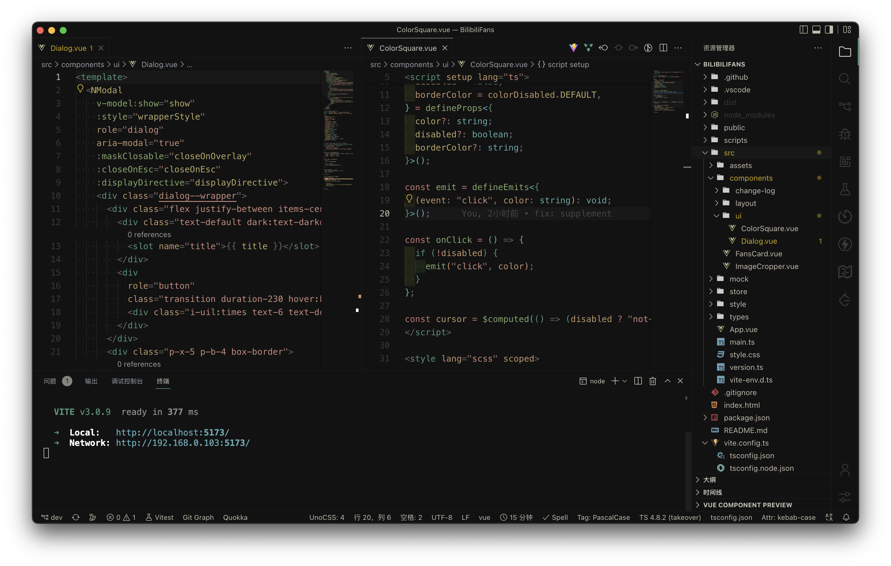
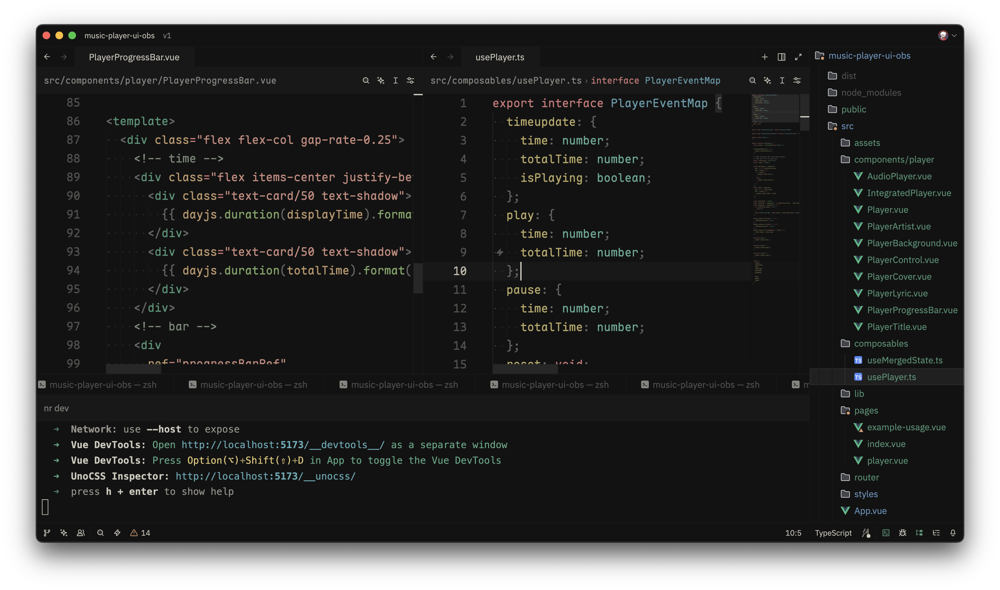

<samp><b>Cole's Editor Settings</b></samp>

- VSCode (extends [antfu/vscode-settings](https://github.com/antfu/vscode-settings))

[`.vscode/settings.json`](.vscode/settings.json) Settings 
[`.vscode/extensions.json`](.vscode/extensions.json) Extensions 
[`.vscode/global.code-snippets`](.vscode/global.code-snippets) Snippets 
[`.continue/config.json`](.continue/config.json) `Continue` settings for VSCode extension 

 

  <samp>VSCode Preview</samp>  
  

- Zed

[`.zed/settings.json`](.zed/settings.json) Settings 

 

  <samp>Zed Preview</samp>  
  

 

    
      Theme | <a href="https://github.com/antfu/vscode-theme-vitesse">Vitesse Theme</a> 
      Font | <a href="https://github.com/subframe7536/Maple-font">Maple Mono</a> | <a href="https://gitee.com/subframe7536">Maple Mono(gitee)</a> 
      File Icons | <a href="https://marketplace.visualstudio.com/items?itemName=file-icons.file-icons">File Icons</a> 
      Product Icons | <a href="https://github.com/antfu/vscode-icons-carbon">Carbon</a>
    

- [Fonts](./font)
